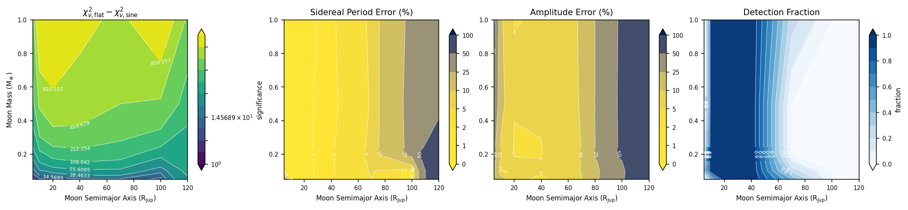

# exomoonsim

**Astrometric exomoon-detection simulator.** Given a telescope's astrometric
precision, it works out which moons — as a function of moon mass and orbital
separation — would leave a detectable wobble in a planet's on-sky motion.

A planet with a moon wobbles around the planet–moon barycenter while that
barycenter orbits the star. `exomoonsim` simulates observing that wobble, tries to
recover the moon's signal, and maps out where in parameter space detection
succeeds. It's a modernized Python port of an IDL codebase (pure `numpy` +
`matplotlib`, parallel via `multiprocessing`).



> New here? Read [`docs/guide.md`](docs/guide.md) first — it explains the science
> and the detection algorithm in a couple of pages.

---

## Install

Python ≥ 3.9. Only `numpy` and `matplotlib` are required.

```bash
git clone https://github.com/astrowagner/exomoonsim_py.git
cd exomoonsim_py
pip install -e .            # installs the package + the `exomoon-survey` command
# for the tests too:  pip install -e ".[test]"
```

## Quickstart

**Command line** — run a survey and save results + a figure:

```bash
# quick 3x3 grid, 10 trials/cell, 10 muas precision, all CPU cores
exomoon-survey --fast --ntrials 10 --precision 1e-5 --output fast.npz --plot fast.png

# full survey (12 masses x 13 separations), 50 trials
exomoon-survey --ntrials 50 --precision 1e-5 --output survey.npz --plot survey.png
```

Useful flags: `--precision` (arcsec; `1e-5` = 10 µas), `--pend` (max search period,
days), `--a-grid`/`--mass-grid` (comma-separated custom grids), `--workers`,
`--seed`. Run `exomoon-survey --help` for all of them.

**Python API:**

```python
from exomoonsim.sim import SimParams, run_trial
from exomoonsim.survey import SurveyConfig, run_survey
from exomoonsim.plots import plot_survey

# one trial: an Earth-mass moon at 10 R_Jup, observed at 10 muas
r = run_trial(SimParams(moon_a=10, moon_mass=1.0, astrometric_precision=1e-5), seed=1)
print(r["sig"], r["perr"], r["amperr"])

# a survey
res = run_survey(SurveyConfig(ntrials=50,
                              base=SimParams(astrometric_precision=1e-5)))
res.save("survey.npz")
plot_survey(res, filename="survey.png")
```

See [`examples/getting_started.py`](examples/getting_started.py) for a fully
commented walkthrough, and [`notebooks/example.ipynb`](notebooks/example.ipynb) for
an interactive version.

## What you get out

Each survey produces four maps over (moon semimajor axis, moon mass):

| output | meaning |
|---|---|
| **significance** | how strongly the periodic moon signal stands out (χ²_flat − χ²_sine) |
| **period error (%)** | error in the recovered sidereal moon period |
| **amplitude error (%)** | error in the recovered wobble amplitude |
| **detection fraction** | fraction of trials passing all cuts — the headline result |

## Package layout

```
exomoonsim/
  constants.py   physical constants & unit conversions
  orbits.py      Kepler solver + on-sky orbit projection
  fit.py         orbit fit (Levenberg-Marquardt) + fixed-period sine fit
  sim.py         SimParams + run_trial (one simulated campaign)
  survey.py      SurveyConfig + run_survey (parallel grid) + save/load
  plots.py       the four-panel figure
  cli.py         the `exomoon-survey` command
docs/guide.md    the science + algorithm, explained
examples/        runnable example scripts
notebooks/       example notebook
tests/           pytest suite
```

## Key parameters

Set on `SimParams` (see the full table in [`docs/guide.md`](docs/guide.md)):
`astrometric_precision`, `duration_days`, `moon_a`, `moon_mass`, the host
(`planet_*`, `star_mass`, `system_distance`), and the period search
(`pstart`, `pend`, `ptestwidth`, `binwidth`, `window`).

```python
SimParams(moon_a=20, moon_mass=0.5, astrometric_precision=1e-5,
          duration_days=10*365.25, pend=600)
```

## Testing

```bash
pip install -e ".[test]"
pytest              # ~a few seconds
```

## Extending it

- **New grid**: pass `a_grid` / `mass_grid` arrays to `SurveyConfig`.
- **New parameter**: add a field to `SimParams` and use it in `sim.run_trial`; it
  flows through the survey automatically (it's a dataclass).
- **Different plot**: `plots.plot_survey` returns a matplotlib `Figure` you can
  restyle; or call `SurveyResult.load(...)` and plot the cubes yourself.

## Notes / provenance

Ported from an IDL simulator and validated cell-by-cell: **detection maps and
period recovery match the original**. The port fits in Cartesian coordinates with a
compact Levenberg–Marquardt (tighter than the original Newton–Raphson) and solves
the fixed-period sine fit exactly, so it is a bit *more* sensitive; absolute
significance runs somewhat higher for the same signal. Results aren't bit-identical
to the IDL (different RNG + fitter) — validate statistically. Details in
[`docs/guide.md`](docs/guide.md) §6.

## License

MIT — see [`LICENSE`](LICENSE).
